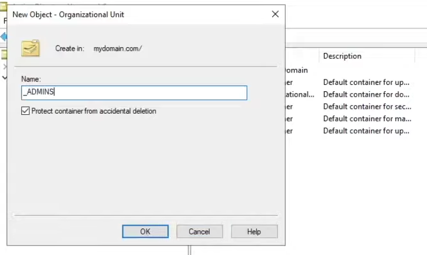

up# Active-Directory-Homelab
Active Directory Homelab

<h2>Description</h2>
This project involves building a Windows Server 2019 Active Directory lab in VirtualBox, with a Domain Controller and a Windows 10 client. It uses a PowerShell script to automate the creation of 1,000+ users, simulating a corporate network environment. The setup was made with Tailscale and RustDesk to make a secure remote in.
 

<h2>Languages and Utilities Used</h2>

<b>PowerShell</b>

<b>Oracle VirtualBox</b>

<b>Tailscale</b>

<b>Rustdesk</b>

<b>Active Directory</b>

<h2>Environments Used </h2>
<b>Windows Server 2019</b> 

<b>Windows 10</b> 

<h2>Setup:</h2>

using Rustdesk with Tailscale to securely remote into my home server:  

 
 

Using Oracle VirtualBox I created a Windows 10 Server VM:  

 
 

Finished installing some QOL items to remove the delayed mouse, enable auto sizing on windows and renamed the machine:  

 
 

Investigated which IP was an internal (VM) IP and which was the orignial internet. Then assigned a specific IP to Internal for the VM network:  

 
 

:  

 
 

:  

 
 

:  

 
 

:  

 
 

:  

 
 

:  

 
 

:  

 
 

:  

 
 

:  

 
 

:  

 
 

